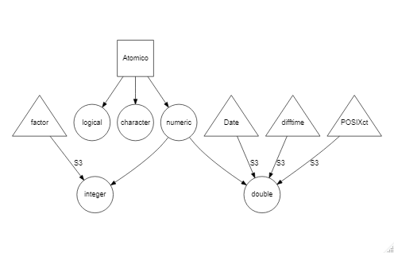
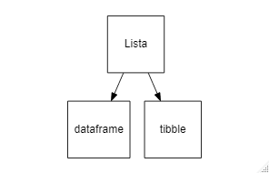

```{r setup, include=FALSE}
knitr::opts_chunk$set(echo = TRUE)
```

# Objetos avanzados

## Clases

Por otro lado, las clases son la descripción del objeto (es el equivalente a los planos de una casa). El ambiente de R tiene cuatro sistemas de clases: **S3**, **S4**, **Reference class** y **R6**.

### Clase S3

Esta es la primer clase manejada por R y la más utilizada en programación. Carece de una definición predeterminada y se puede crear simplemente al añadir un atributo de clase con el comando `class()`:

```{r, collapse=TRUE,prompt=TRUE}
    #   Elaboro un objeto que contiene un vector numerico sin clase definida

Ob3 <- list(nombre="Ramiro",edad=36,estatura=1.68)
Ob3
str(Ob3)

    #   Ahora declaro su clase con el comando "class()"

class(Ob3) <- "estatura"
Ob3     #   listo, ahora tenemos un objeto de la clase "estatura"
str(Ob3)
#c(1.65,1.61,1.72,1.84,1.55,1.63,1.67,1.68,1.68,1.65,1.64,1.71)
```

Contrario a otros lenguajes de programación orientados a objetos (C++ o Python), donde hay definiciones de clase formales y los objetos tienen atributos y métodos definidos; el sistema S3 de R permite convertor la clase de un objeto de forma *ad hoc*. A su vez, permite nombrar objetos que contienen distinta información con la misma clase.

#### Vectores atómicos S3

Existen asignaciones de clase S3 para vectores atómicos que modifican la información que almacenan. Estos son los cuatro vectores atómicos S3 más importantes en R:

* **Factores:** Variables categóricas que contienen un número establecido de *niveles*. Se almacenan en vectores `factor`.
* **Fecha:** Registros de fechas con resolución de día. Se almacenan en vetores `Date`.
* **Fecha-hora:** Registros de fecha con resolución de segundos. Se almacenan en vectores `POSIXvc`.
* **Duraciones:** Registros de tiempo. Se almacenan en vectores `difftime`.

<center>

</center>

##### Factores

Los factores son vectores que contienen valores predefinidos y se usan para almacenar información categórica. Los factores se construyen sobre un vector numérico discreto (integer) y presenta dos atributos: una clase *factor* que lo diferencía de otros vectores discretos y los *niveles*, que definen el grupo de valores permitidos. Para generar un factor, se emplea el comando `factor()`:

```{r, collapse=TRUE,prompt=TRUE}
    #   Elaboracion de un factor

x <- factor(c("a", "b", "b", "a"))
x   #   A pesar haber cuatro valores, solo observamos dos niveles

    #   Al analizar el tipo de vector atomico al que corresponde, vemos que se lee como un integer

typeof(x)

    #   Por ultimo, veamos los atributos asigandos a este vector

attributes(x)
```

Los factores son útiles cuando la representación de los valores no es completa en un grupo de datos.

```{r,collapse=TRUE,prompt=TRUE}
    #   Elaboramos un vector de caracteres

sex_char <- c("m", "m", "m")

    #   Establecemos los niveles existentes dentro del comando "factor()"

sex_factor <- factor(sex_char, levels = c("m", "f"))

    #   Observamos la frecuencia de observaciones con el comando "table()"

table(sex_char)

table(sex_factor)
```

También podemos generar factores ordenados, que son el equivalente a las variables cualitativas ordinales. Esto se logra con el comando `ordered()`

```{r,collapse=TRUE,prompt=TRUE}
niv_eco <- ordered(c("bajo", "bajo", "alto", "medio"), levels = c("bajo", "medio", "alto"))
niv_eco
```

##### Fechas

Por su parte, las fechas se construyen a partir de vectores numéricos continuos (double) y solo presentan la clase `Date`.

```{r,collapse=TRUE,prompt=TRUE}
    #   Generamos un objeto de fecha usando la fecha registrada en el sistema con "Sys.Date()"

today <- Sys.Date()
today
str(today)

    #   Al analizar el tipo de vector atomico al que corresponde, vemos que se lee como un double

typeof(today)

    #   Por ultimo, veamos los atributos asigandos a este vector

attributes(today)

    #   Ahora elaboremos un vector de fecha con nuestra fecha de nacimiento

nacimiento <- as.Date("1985-10-08")
nacimiento

    #   El valor double representa el numero de dias a partir de 1970-01-01 (Inicio de la epoca UNIX o POSIX time)
unclass(nacimiento)
```

##### Fecha-hora

El ambiente de R almacena la información de fecha-hora en el formato *Portable Operating System Interface* (POSIX) ya sea en tiempo de calendario (ct) o local (lt). Ambos formatos se construyen sobre vectores double y sus valores representan el número de segundos desde el inicio de la época UNIX.

```{r,collapse=TRUE,prompt=TRUE}
    #   Formato "POSIXct"

nac_ct <- as.POSIXct("1985-10-08 7:00", tz = "UTC")
nac_ct
typeof(nac_ct)
attributes(nac_ct)
unclass(nac_ct)

    #   Formato "PISIXlt"

nac_lt <- as.POSIXlt("1985-10-08 7:00", tz = "UTC")
nac_lt$sec
nac_lt$min
nac_lt$hour
nac_lt$mday
nac_lt$mon
nac_lt$year
nac_lt$wday
nac_lt$yday
nac_lt$isdst

typeof(nac_lt)
typeof(nac_lt$sec)

attributes(nac_lt)
```

El atributo `tzone` del comando `structure()` controla el formato de la fecha, más no el instante de tiempo representado. 

```{r,collapse=TRUE,prompt=TRUE}
nac_ct

    #   Ahora veamos distintos formatos dependiendo de la zona horaria

structure(nac_ct, tzone = "Asia/Tokyo")
structure(nac_ct, tzone = "America/New_York")
structure(nac_ct, tzone = "Australia/Lord_Howe")
structure(nac_ct, tzone = "Europe/Paris")
```

##### Duraciones

Por último, las duraciones representan el tiempo entre pares de fechas o fechas-hora. El resultado se almacena como tiempos de diferencia. Estos tiempos de diferencia se construyen sobre vectores double y el atributo `units` determina como se debe interpretar el valor.

```{r,collapse=TRUE,prompt=TRUE}

dur_sem <- as.difftime(4, units = "weeks")
dur_sem
typeof(dur_sem)
attributes(dur_sem)

dur_dia <- as.difftime(8, units = "days")
dur_dia
typeof(dur_dia)
attributes(dur_dia)

    #   Analicemos la duracion del curso

f1 <- as.POSIXct("2020-03-10 16:00", tz = "America/Mexico_City")    #   Inicio
f2 <- as.POSIXct("2020-04-02 18:00", tz = "America/Mexico_City")    #   Final

duracion <- f2-f1
duracion
attributes(duracion)
```

#### Vectores lista S3

Los dos principales objetos S3 que se elaboran a partir de listas son las tablas (`data.frame`) y los tibbles.

<center>

</center>

##### Tablas

Las tablas son de los objetos más comunes en R para el análisis de datos y consiste en una lista de vectores con atributos `names` (para columnas) y `row.names` (para filas) y la clase `data.frame`. A diferencia de las listas, la longitud de los vectores del `data.frame` debe ser la misma, resultando en una estructura rectangular que comparte las propiedades de las matrices y las listas.

Además, una tabla tiene:

* `rownames()` (nombre de filas)
* `colnames()`/`names()` (nombre de columnas)
* `nrow()` (número de filas)
* `ncol()`/`length()` (número de columnas)

Las tablas son de los objetos más comunes en R para el análisis de datos y consiste en una lista de vectores con atributos `names` (para columnas) y `row.names` (para filas) y la clase `data.frame`. A diferencia de las listas, la longitud de los vectores del `data.frame` debe ser la misma, resultando en una estructura rectangular que comparte las propiedades de las matrices y las listas. Además, una tabla tiene `rownames()` (nombre de filas), `colnames()`/`names()` (nombre de columnas), `nrow()` (número de filas) y `ncol()`/`length()` (número de columnas).

```{r,collapse=TRUE,prompt=TRUE}
df1 <- data.frame(x = 1:3, y = letters[1:3])
df1
str(df1)
typeof(df1)
attributes(df1)

rownames(df1)
colnames(df1)
names(df1)
nrow(df1)
ncol(df1)
length(df1)
```

##### Tibbles

Los tibbles son una versión moderna de las tablas creadas en 2018. Algunas de sus ventajas sobre los `data.frame` son las siguientes:

* No cambia el tipo de variable (los data.frame automáticamente asignan las variables de texto como factores)

```{r,collapse=TRUE,prompt=TRUE}
    #   Los data.frame asignan automaticamente la clase "factor" a la variable con caracteres

x <- data.frame(x = letters)
x
str(x)

    #   Los tibble no transforman las variables de caracteres a factores

require(tibble)

x <- tibble(x = letters)
x
str(x)

    #   Esto facilita su uso con columnas de listas:

tibble(x = 1:3, y = list(1:5, 1:10, 1:20))
```

* No ajusta el nombre de las variables

```{r,collapse=TRUE,prompt=TRUE}
    #   Los titulos de las columnas en data.frame no pueden llevar espacios

names(data.frame(`crazy name` = 1))

    #   Por su parte, los titulos de columna de un tibble si soportan los espacios

names(tibble(`crazy name` = 1))
```

* Evalúa los argumentos de forma secuencial

```{r,collapse=TRUE,prompt=TRUE}
tibble(x = 1:5, y = x ^ 2)
```

* No emplea el comando `row.names()`

* Mientras `data.frame()` recicla las columnas que son multiplo de la dimension de la columna más larga, los tibbles solamente reciclan los vectores de dimension uno

```{r,collapse=TRUE,prompt=TRUE,error=TRUE}
data.frame(x = 1:4, y = 1:2)
data.frame(x = 1:4, y = 1:3)

tibble(x = 1:4, y = 1)
tibble(x = 1:4, y = 1:2)
```

### Clase S4

Esta clase de objeto tiene una estructura formalmente definida. Esto permite controlar la forma en que creamos objetos. La clase de los objetos se define con el comando `setclass()` y los objetos se crean con el comando `new()`:

```{r, collapse=TRUE,prompt=TRUE}
setClass("personal",slots = list(nombre="character",edad="numeric",estatura="numeric"))
Ob4 <- new("personal", nombre="Ramiro",edad=36,estatura=1.68)
Ob4
```

Podemos verificar si el objeto es de la clase S4 con el comando `isS4()`:

```{r, collapse=TRUE,prompt=TRUE}
isS4(Ob4)
```

### Clase referencia

Este tipo de clase es último incorporado a R respecto a las clases S3 y S4. Sus características son más similares a las clases usadas en otros lenguajes de programación orientados a objetos. El comando `setRefClass()` da como resultado una función generadora de objetos con clase de referencia:

```{r, collapse=TRUE,prompt=TRUE}
personal <- setRefClass(Class = "personal",
                        fields = list(nombre="character",edad="numeric",estatura="numeric"))
    #   Ahora personal() es una funcion generadora que puede crear objetos nuevos
```
