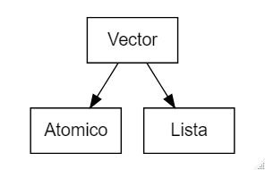
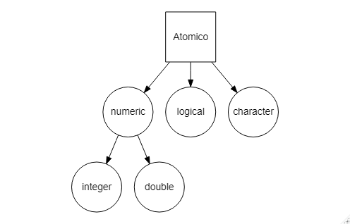

```{r setup, include=FALSE}
knitr::opts_chunk$set(echo = TRUE)
```

# Objetos básicos

## Vectores

R tiene un espacio de trabajo conocido como el ambiente global o *global environment* donde se almacena tanto el resultado de los cálculos, como diversos objetos. Un objeto es una estructura de datos que contiene *atributos* y *métodos*, estos últimos responden a sus atributos.

El objeto más sencillo e importante en R son los *vectores*, los cuáles almacenan una cadena de información. Existen dos tipos de vectores, los *atómicos* que solo permiten información de un mismo tipo y las *listas*, que pueden incluir distintos tipos de información.
<center>

</center>

### Atómicos

Son las estructuras de datos más simples en R. Se clasifican en cuatro tipos: caracteres (character) lógicos (logical) y numéricos (numeric); estos últimos a su vez pueden ser discretos (integer) y continuos (double).
<center>

</center>
Los caracteres son cadenas de letras o palabras que están entre comillas sencillas ('hola') o dobles ("hola"). Por su parte los datos lógicos representan argumentos verdaderos o falsos, ya sea abreviados (T o F) o completos (TRUE o FALSE). Los valores double se pueden expresar con decimales (3.1416), notación científica (3.12e4) o hexadecimales (0xcafe). También se pueden presentar valores infinitos (-Inf, Inf) y no numéricos (NaN, que significa **not a number**). Los valores integer son similares a los double, con la diferencia de que no presentan decimales y son seguidos de una L (1234L, 3e4 o 0xcafeL). Para generar vectores largos, se utiliza el comando de combinar/concatenar `c()`:

```{r, collapse=TRUE,prompt=TRUE}
lgl_var <- c(TRUE, FALSE)
int_var <- c(1L, 6L, 10L)
dbl_var <- c(3.141, 4.1e-3, 0xcafe)
chr_var <- c("estas leyendo", "algunos caracteres")

lgl_var
int_var
dbl_var
chr_var
```

Se puede determinar el tipo de vector y su tamaño de dos formas diferentes:

* A través de los comandos `typeof()` y `length()`

```{r, collapse=TRUE,prompt=TRUE}
typeof(lgl_var)
typeof(int_var)
typeof(dbl_var)
typeof(chr_var)

length(lgl_var)
length(int_var)
length(dbl_var)
length(chr_var)
```

* A través del comando `str()`

```{r, collapse=TRUE,prompt=TRUE}
str(lgl_var)
str(int_var)
str(dbl_var)
str(chr_var)
```

Los valores inexistentes o desconocidos se representan con el valor NA (not applicable). Las operaciones que involucren valores inexistentes suelen resultar en otros valores inexistentes, salvo algunas excepciones.

```{r, collapse=TRUE,prompt=TRUE}
    #   Operaciones que resultan en NA

3+NA
5-NA
NA*4
21/NA
!NA
NA > 10
NA < 5

    #   Los casos que no resultan en NA suelen presentarse cuando los valores de entrada tienen algun valor

NA^0
NA | TRUE
NA & FALSE
```

#### Verificación

Para verificar a que tipo de datos pertenece un vector atómico, se utilizan los comandos `is.logical()`, `is.integer()`, `is.double()`, `is.character()` e `is.na()`.

```{r, collapse=TRUE,prompt=TRUE}
na_var <- c(NA, NA, NA)

is.logical(lgl_var);is.logical(int_var);is.logical(dbl_var);is.logical(chr_var);is.logical(na_var)
is.integer(lgl_var);is.integer(int_var);is.integer(dbl_var);is.integer(chr_var);is.integer(na_var)
is.double(lgl_var);is.double(int_var);is.double(dbl_var);is.double(chr_var);is.double(na_var)
is.character(lgl_var);is.character(int_var);is.character(dbl_var);is.character(chr_var);is.character(na_var)
is.na(lgl_var);is.na(int_var);is.na(dbl_var);is.na(chr_var);is.na(na_var)
```

#### Coerción

También se puede coercionar el tipo de dato con los comandos `as.logical()`, `as.integer()`, `as.double()` y `as.character()`

```{r, collapse=TRUE,prompt=TRUE}
as.logical(lgl_var);as.logical(int_var);as.logical(dbl_var);as.logical(chr_var)
as.integer(lgl_var);as.integer(int_var);as.integer(dbl_var);as.integer(chr_var)
as.double(lgl_var);as.double(int_var);as.double(dbl_var);as.double(chr_var)
as.character(lgl_var);as.character(int_var);as.character(dbl_var);as.character(chr_var)
```

También se puede coercionar al combinar diferentes tipos de datos en un vector. La coerción ocurre en el orden: character -> double -> integer -> logical

```{r, collapse=TRUE,prompt=TRUE}
str(c("a", 3.14))
str(c("a", 1))
str(c(TRUE,"d"))
str(c(3.14, 1))
str(c(FALSE,3.14))
str(c(1,FALSE))
```

#### Atributos

Los atributos de un vector atómico son listas pareadas que contienen metadatos de un objeto. Los atributos permiten la posterior construcción de vectores lista (arreglos, factores, matrices o fechas). Estos se pueden obtener o modificar individualmente con el comando `attr()`, obtener de forma masiva con el comando `attributes()` y establecer masivamente con el comando `structure()`.

```{r, collapse=TRUE,prompt=TRUE}
a <- 1:3

    #   Agregamos el atributo "x" al vector "a" que contiene "abcdef"

attr(a, "x") <- "abcdef"
attr(a, "x")    #   El atributo "x" del vector "a" se llama "abcdef"
attributes(a)

    #   Agregamos un nuevo atributo de nombre "y" que contiene los numeros 4 5 6

attr(a, "y") <- 4:6
attr(a, "y")
attributes(a)

    #   Observemos la estructura tanto del vector "a", como de sus atributos

str(a)
str(attributes(a))

    #   Podemos elaborar el mismo proceso en un solo paso empleando el comando "structure()"

a <- structure(1:3, x = "abcdef", y = 4:6)
attr(a, "x")
attr(a, "y")
str(a)
str(attributes(a))
```

Existen atributos que están restingidos en el tipo de valores que pueden incluirse, entre ellos `class`, `comment`, `dimnames`, `row.names` y `tsp`. Estos los abordaremos más adelante. Los atributos generalmente se pierden al efectuar operaciones que reducen el número de observaciones en el vector.

```{r, collapse=TRUE,prompt=TRUE}
attributes(a)   #   Sin cambios
attributes(sum(a))  #   Se pierde el atributo
attributes(mean(a)) #   Se pierde el atributo
attributes(a[1])    #   Se pierde el atributo
attributes(a[c(1,3)])   #   Se pierde el atributo
attributes(a*2) #   Sin cambios
```

Para preservarlos, es necesario crear sus propias clases S3 (lo veremos en la sección *estructuras avanzadas*). Los únicos atributos que se preservan después de una operación son los nombres (`names()`) y las dimensiones (`dim()`).

##### Nombres

Un vector se puede nombrar de cuatro formas:

```{r, collapse=TRUE,prompt=TRUE}
    #   La primera en el momento de crear el vector
x <- c(a=1, b=2, c=3)
x

    #   La segunda con el comando "names()"

x <- 1:3
names(x) <- c("a", "b", "c")
x

    #   La tercera en la misma linea con el comando"setNames()"

x <- setNames(1:3, c("a", "b", "c"))
x

    #   La cuarta con el comando "attr()"

x <- 1:3
attr(x, "names") <- c("a", "b", "c")
x

    #   Podemos eliminar los nombres con los comandos "unname()" y la instruccion "names(x) <- NULL"

x <- setNames(1:3, c("a", "b", "c"))
x <- unname(x)
x

x <- setNames(1:3, c("a", "b", "c"))
names(x) <- NULL
x
```

**NOTA**: Los nombres deben de ser únicos y completos (que no falten nombres). Los nombres omitidos pueden mostrarse como `" "` o `NA_character_`

##### Dimensiones

Este atributo modifica las dimensiones del vector, ya sea a una matriz de dos dimensiones o un arreglo de múltiples dimensiones. Ambos objetos son elementos comunes de funciones matemáticas y estadísticas, de manera que las abordaremos contínuamente durante el curso. Existen tres formas de asignar dimensiones para matrices y arreglos:

```{r,collapse=TRUE,prompt=TRUE}
        #   MATRICES

    #   Podemos elaborar matrices con el comando "matrix()"

a <- matrix(1:6, nrow = 2, ncol = 3)
a

    #   Una matriz tambien puede ser generada con el comando "dim()"

a <- 1:6
dim(a) <- c(2,3)
a

    #   Finalmente, podemos hacerlo al nombrar sus atributos

a <- 1:6
attr(a, "dim") <- c(2,3)
a

        #   ARREGLOS

    #   Para crear un arreglo, usamos el comando "array()"

b <- array(1:12, c(2,3,2))
b

    #   Tambien con el comando "dim()"

b <- 1:12
dim(b) <- c(2,3,2)
b

    #   Finalmente, con el comando "attr()"

b <- 1:12
attr(b, "dim") <- c(2,3,2)
b

        #   ESTRUCTURA Y DIMENSIONES

    #   Podemos verificar las dimensiones de los objetos con los comandos "dim()" y "str()"

dim(x)  #   Los vectores sin dimension asignada se muestran como "NULL"
dim(a)
dim(b)

str(x)
str(a)
str(b)

    #   Estas diferencias se notan incluso cuando las matrices o arreglos tienen solo una fila/columna

str(1:3)
str(matrix(1:3, ncol = 1))  #   Matriz con una columna
str(matrix(1:3, nrow = 1))  #   Matriz con una fila
str(array(1:3, 3))  #   Arreglo sencillo
```

### Listas

A diferencia de los vectores atómicos, los elementos de una lista pueden ser de cualquier tipo. Esto se debe a que cada elemento de una lista es solo la referencia a otro objeto (piensen en los cajones de un clóset, todos los cajones son iguales, pero cada uno guarda distintas prendas y accesorios). Una lista se puede crear con el comando `list()`:

```{r,collapse=TRUE,prompt=TRUE}
    #   Elaboramos una lista que contiene distintos tipos de vectores atomicos

l1 <- list(1:3,  "a", c(TRUE, FALSE, TRUE), c(2.3, 5.9))
l1

    #   Veamos  que tipo de vector corresponde

typeof(l1)

    #   Ahora exploremos su estructura

str(l1)
```

Las listas son vectores recursivos, es decir, que una lista puede contener otras listas (esto es una característica que las diferencía de los vectores atómicos). También se pueden combinar múltiples listas en una sola con el comando `c()`:

```{r,collapse=TRUE,prompt=TRUE}
    #   Lista recursiva (anidada)

l2 <- list(list(list(1)))
l2
str(l2)

    #   Anidamiento de listas

l3 <- list(list(1, 2), c(3, 4))
l3

    #   Combinacion de listas

l4 <- c(list(1, 2), c(3, 4))
l4

str(l3)
str(l4)
```

La verificación y coerción de listas se efectúa con los comandos `is.list()` y `as.list()` respectivamente.

```{r,collapse=TRUE,prompt=TRUE}
    #   Verifiacion

l5 <- list(1:3)
is.list(l5)

    #   Coercion

l6 <- c(1:3)
l6
is.list(l6) #   No es una lista

l6 <- as.list(l6)
l6
is.list(l6) #   Si es una lista
```

#### Matrices y arreglos

Con el comando `dim()`, se pueden crear matrices o arreglos de listas.

```{r,collapse=TRUE,prompt=TRUE}
        #   MATRIZ

    #   Elaboramos la lista
l7 <- list(1:3, "a", TRUE, 1.0)
l7

    #   Ahora acomodamos los elementos de la lista como si fueran una matriz

dim(l7) <- c(2, 2)
l7

    #   Podemos acceder al elemento de la lista usando doble corchete [[]]

l7[[1]]
l7[[2]]

    #   Tambien podemos acceder a multiples elementos de una lista usando un solo corchete

l7[1:2] #   Accedo a los elementos uno y dos
l7[c(1,4)]  #   Accedo a los elementos uno y cuatro

        #   ARREGLO

    #   Elaboramos la lista

l8 <- list(1:6, c("a", "b", "c"), c(3.15, 2.86, 9.99), c(TRUE,FALSE), "hola", FALSE)
l8

    #   Acomodamos los elementos como un arreglo

dim(l8) <- c(3,1,2)
l8
```

Estas estructuras de datos son muy útiles cuando se encuentren elaborando análisis que requieran un arreglo de objetos en gradilla.